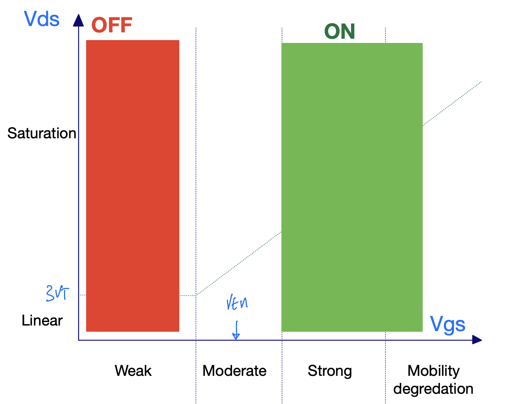
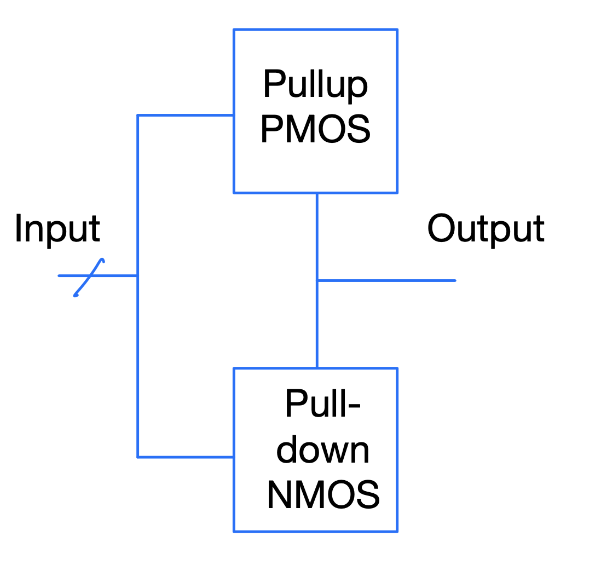
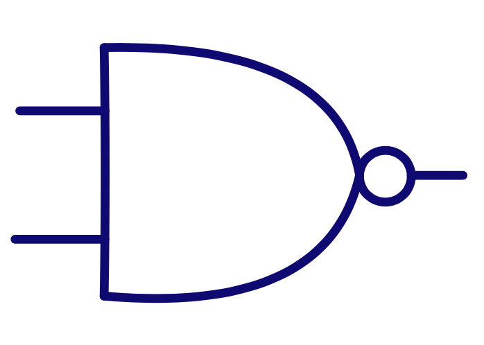
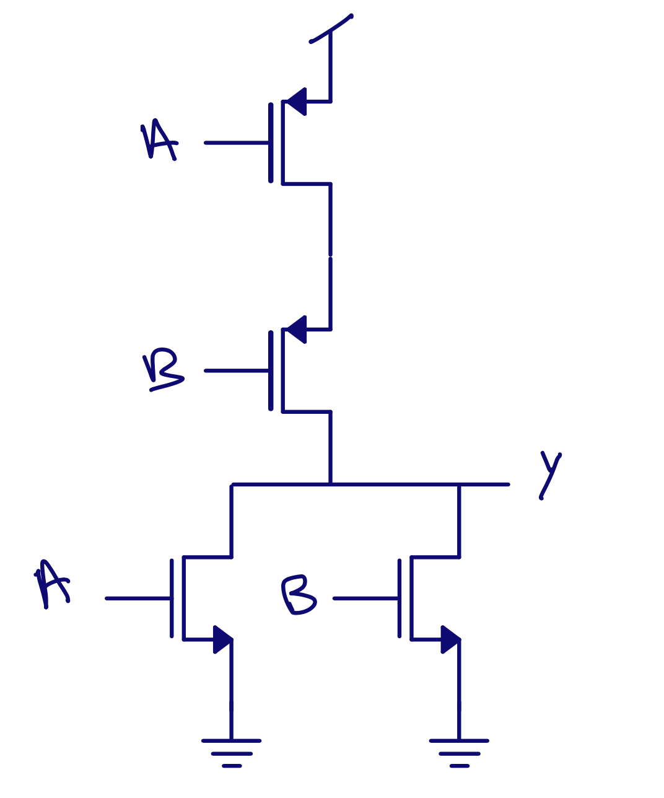
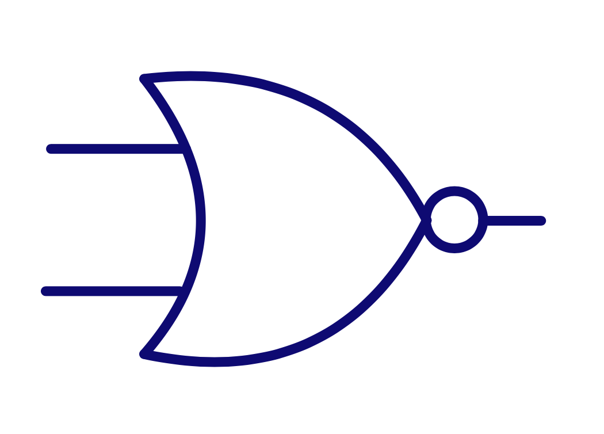

footer: Carsten Wulff 2021
slidenumbers:true
autoscale:true
theme: Plain Jane, 1
text:  Helvetica
header:  Helvetica

## TFE4152 - Lecture 13
# CMOS Logic

## [Source](https://github.com/wulffern/dic2021/blob/main/lectures/l13_logic.md)

---

| Week | Book                    | Monday                                                                    | Book                    | Friday                               |
|------|-------------------------|---------------------------------------------------------------------------|-------------------------|--------------------------------------|
| 34   |                         | Introduction, what are we going to do in this course. Why do you need it? | WH 1 , WH 15            | Manufacturing of integrated circuits |
| 35   | CJM 1.1                 | pn Junctions                                                              | CJM 1.2 WH 1.3, 2.1-2.4 | Mosfet transistors                   |
| 36   | CJM 1.2 WH 1.3, 2.1-2.4 | Mosfet transistors                                                        | CJM 1.3 - 1.6           | Modeling and passive devices         |
| 37   |                         | Guest Lecture - Sony                                                      | CJM 3.1, 3.5, 3.6       | Current mirrors                      |
| 38   | CJM 3.2, 3.3,3.4 3.7    | Amplifiers                                                                | CJM, CJM 2 WH 1.5   | SPICE simulation         |
| 39   |                         | Verilog                                                                   |                         | Verilog                              |
| 40   | WH 1.4 WH 2.5           | **CMOS Logic**                                                                | WH 3                    | Speed                                |
| 41   | WH 4                    | Power                                                                     | WH 5                    | Wires                                |
| 42   | WH 6                    | Scaling Reliability and Variability                                       | WH 8                    | Gates                                |
| 43   | WH 9                    | Sequencing                                                                | WH 10                   | Datapaths - Adders                   |
| 44   | WH 10                   | Datapaths - Multipliers, Counters                                         | WH 11                   | Memories                             |
| 45   | WH 12                   | Packaging                                                                 | WH 14                   | Test                                 |
| 46   |                         | Guest lecture - Nordic Semiconductor                                      |                         |                                      |
| 47   | CJM                     | Recap of CJM                                                              | WH                      | Recap of WH                          |

---
# Goal for today

Analog transistor to digital transistor

Fundamental static logic cells

Other static logic cells

Project Questions

(If time: [Sesame Demo](https://sesame.readthedocs.io/en/latest/index.html))

---
#[fit] Analog transistor to digital transistor
---

 NMOS current (W = 0.4u L=0.15u) as a function of $$V_{GS}$$ and $$V_{DS}$$

<sub><sub>[dicex/lectures/l13/mos.py]()


---


---



---

| Gate | NMOS | PMOS |
|:---: | :---: | :---:|
| VDD | ON | OFF|
| VDD -> VSS | X | X |
| VSS -> VDD | X | X |
| VSS | OFF | ON |

---

| Gate | NMOS | PMOS |
|:---: | :---: | :---:|
| 1 | ON | OFF|
| 1 -> 0 | X | X |
| 0 -> 1 | X | X |
| 0 | OFF | ON |

---

# CMOS static logic assumptions

NMOS source is connected to low potential

$$ V_{GS} > V_{TH}$$ when $$V_G = V_{DD}$$


PMOS source is connected to high potential

$$ V_{GS} < V_{TH}$$ when $$V_G = 0$$


---


---
[.background-color: #000000]
[.text: #FFFFFF]

# Don't break rules unless you know exactly why it will be OK

---
#[fit] Logic cells
--- 


---

## CMOS static logic is inverting


| A | Y |
|:---: | :---: | 
| 1 | 0 | 
| 0 | 1 | 


---


<sub>PD = Pull-down PU = Pull-up</sub>

```verilog
logic => [0,1,Z,X];
```



---
[.table-separator: #000000, stroke-width(1)] 
[.table: margin(8)]


*Pull-up series*

| A | B | Y |
|:---|:---|:---|
| 0 | 0 | 1 |
| 0 | 1 | Z |
| 1 | 0 | Z |
| 1 | 1 | Z |

*Pull-up paralell*

| A | B | Y |
|:---|:---|:---|
| 0 | 0 | 1 |
| 0 | 1 | 1 |
| 1 | 0 | 1 |
| 1 | 1 | Z |


---
[.table-separator: #000000, stroke-width(1)] 
[.table: margin(8)]

*Pull-down series*

| A | B | Y |
|:---|:---|:---|
| 0 | 0 | Z |
| 0 | 1 | Z |
| 1 | 0 | Z |
| 1 | 1 | 0 |

*Pull-down paralell*

| A | B | Y |
|:---|:---|:---|
| 0 | 0 | Z |
| 0 | 1 | 0 |
| 1 | 0 | 0 |
| 1 | 1 | 0 |


---

## Rules for inverting logic

**Pull-up**
OR $$\Rightarrow$$ PMOS in series $$\Rightarrow$$ POS 
AND $$\Rightarrow$$ PMOS in paralell $$\Rightarrow$$ PAP

**Pull-down**
OR $$\Rightarrow$$ NMOS in paralell $$\Rightarrow$$ NOP 
AND $$\Rightarrow$$ NMOS in series $$\Rightarrow$$ NAS 


---

[.column]

# Memnonic 

Crazier the better

POS, PAP, NOP, NAS

### A **Pos**traumatic **Pap**aya was walking on the Moon. **Nop**e, it was a **NAS**A astronaut.

[.column]


[Moonwalking with Einstein](https://www.amazon.com/Moonwalking-Einstein-Science-Remembering-Everything/dp/0143120530)

---

[.table-separator: #000000, stroke-width(1)] 
[.table: margin(8)]

## $$ \text{Y} = \overline{\text{AB}} = \text{NOT ( A AND B)}$$

 **AND**
 PU $$\Rightarrow$$ PMOS in paralell
 PD  $$\Rightarrow$$ NMOS in series


<sub>A **Pos**traumatic **Pap**aya was walking on the Moon. **Nop**e, it was a **NAS**A astronaut.</sub>


| A | B | <sub>NOT(A AND B)</sub> |
|:---|:---|:---|
| 0 | 0 | 1 |
| 0 | 1 | 1 |
| 1 | 0 | 1 |
| 1 | 1 | 0 |

---




---
[.table-separator: #000000, stroke-width(1)] 
[.table: margin(8)]


## $$ \text{Y} = \overline{\text{A + B}} = \text{NOT ( A OR B)}$$  

**OR**
PU $$\Rightarrow$$ PMOS in series
PD  $$\Rightarrow$$ NMOS in paralell

<sub>A **Pos**traumatic **Pap**aya was walking on the Moon. **Nop**e, it was a **NAS**A astronaut.</sub>



| A | B | <sub>NOT(A OR B)</sub> |
|:---|:---|:---|
| 0 | 0 | 1 |
| 0 | 1 | 0 |
| 1 | 0 | 0 |
| 1 | 1 | 0 |


---




---

   

---

# $$SR$$-Latch

Use boolean expressions to figure out how gates work. 

Remember De-Morgan 

$$\overline{AB}  = \overline{A}+ \overline{B}$$
$$\overline{A+B}  = \overline{A} \cdot \overline{B}$$


 $$ Q = \overline{R \overline{Q}} = \overline{R} +
\overline{\overline{Q}} = \overline{R} + Q $$

 $$ \overline{Q} = \overline{S Q} = \overline{S} +
\overline{Q} = \overline{S} + \overline{Q} $$


---

# $$SR$$-Latch

$$ Q = \overline{R} + Q $$, $$ \overline{Q} =\overline{S} + \overline{Q} $$

| S | R | Q | ~Q |
|:---|:---|:---| :---|
| 0 | 0 | X | X |
| 0 | 1 | 0 | 1 |
| 1 | 0 | 1 | 0 |
| 1 | 1 | Q | ~Q |


---

# D-Latch (16 transistors)

| C | D | Q | ~Q |
|:---|:---|:---| :---|
| 0 | X | Q | ~Q |
| 1 | 0 | 0 | 1 |
| 1 | 1 | 1 | 0 |


---
[.background-color: #000000]
[.text: #FFFFFF]
# Digital can be synthesized in conductive peanut butter <sub><sub> Barrie Gilbert? </sub></sub>

---

#[fit] Other logic cells

---

# What about $$\text{Y} = \text{AB}$$ and $$\text{Y} = \text{A} + \text{B}$$?


[.column]

# $$\text{Y} = \text{AB} = \overline{\overline{\text{AB}}}$$

**Y** = **A** AND **B** = NOT( NOT( **A** AND **B** ) )


[.column]

# $$\text{Y} = \text{A+B} = \overline{\overline{\text{A+B}}}$$

**Y** = **A** OR **B** = NOT( NOT( **A** OR **B** ) )


---

# AOI22: and or invert

 **Y** = NOT( **A** AND **B** OR **C** AND **D**) 

 $$\text{Y} =  \overline{\text{AB} + \text{CD}}$$
 


A **Pos**traumatic **Pap**aya was walking on the Moon. **Nop**e, it was a **NAS**A astronaut.


---


---
[.table-separator: #000000, stroke-width(1)] 
[.table: margin(8)]

# Tristate inverter

| E | A | Y |
|:---|:---|:---|
| 0 | 0 | Z |
| 0 | 1 | Z |
| 1 | 0 | 1 |
| 1 | 1 | 0 |


---

[.table-separator: #000000, stroke-width(1)] 
[.table: margin(8)]

# Mux

| S |  Y |
|:---|:---|
| 0 | NOT(P1) |
| 0 | NOT(P1) |
| 1 | NOT(P0) |
| 1 | NOT(P0) |


---
D-Latch (12 transistors)


---
D-Flip Flop (< 26 transistors)


---


---


# There are other types of logic

[.column]
- True single phase clock (TSPC) logic
- Pass transistor logic
- Transmission gate logic
- Differential logic
- Dynamic logic

[.column]
Consider other types of logic "rule breaking", so you should know why you need it.

---


<sub><sub>Dynamic logic => [A Compiled 9-bit 20-MS/s 3.5-fJ/conv.step SAR ADC in 28-nm FDSOI for Bluetooth Low Energy Receivers](https://ieeexplore.ieee.org/document/7906479)</sub></sub>

---
[.background-color: #000000]
[.text: #FFFFFF]
## Zen of electronics design [^1]

[.column]

Beautiful is better than ugly.

Explicit is better than implicit.

Simple is better than complex.

Complex is better than complicated.

Readability counts.

Special cases aren't special enough to break the rules.

[.column]

Although practicality beats purity.

In the face of ambiguity, refuse the temptation to guess.


Now is better than never.

Although never is often better than *right* now.

If the implementation is hard to explain, it's a bad idea.

If the implementation is easy to explain, it may be a good idea.


[^1]: [Zen of Python](https://www.python.org/dev/peps/pep-0020/) 

---

#[fit] Sesame 

---

Sesame is a Python3 package for solving the drift diffusion Poisson equations for multi-dimensional systems using finite differences.

[Install instructions](https://sesame.readthedocs.io/en/latest/pre/INSTALL_beginner.html)


<sub>Semiconductor current-flow equations (diffusion and degeneracy), R.Stratton,
IEEE Transactions on Electron Devices
[https://ieeexplore.ieee.org/document/1477063](https://ieeexplore.ieee.org/document/1477063)</sub>


---


---


---


---

#[fit] Thanks!


