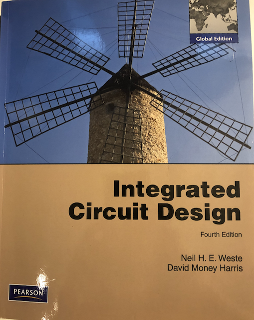

footer: Carsten Wulff 2021
slidenumbers:true
autoscale:true
theme: Plain Jane, 1
text:  Helvetica
header:  Helvetica
    
## TFE4152 - Lecture 1 
# Design of Integrated Circuits

---
# Goal for today
* Who are we
* Introduce Course
* Introduce Exercisess
* Introduce Project
* Introduce Software
* What will we focus on in this course

---

#[fit] Who

---

# Carsten Wulff [carstenw@ntnu.no](carstenw@ntnu.no)


---

# Teaching assistants

- Eshan Lari
- Erlend Kristian Berg
- Jonas Gjendem Røysland 

---

#[fit] Course

---
# [Description](https://www.ntnu.no/studier/emner/TFE4152#tab=omEmnet)
# [Time schedule] (https://tp.uio.no/ntnu/timeplan/?id=TFE4152&sem=21h&sort=form&type=course)

---


[.column]


[.column]


---

# [Curriculum](https://github.com/wulffern/dicex/blob/main/book/icd.md)

---

# Lecture plan

| Week | Book                    | Monday                                                                    | Book                    | Friday                               |
|------|-------------------------|---------------------------------------------------------------------------|-------------------------|--------------------------------------|
| 34   |                         | Introduction, what are we going to do in this course. Why do you need it? | WH 1                    | Manufacturing of integrated circuits |
| 35   | CJM 1.1                 | pn Junctions                                                              | CJM 1.2 WH 1.3, 2.1-2.4 | Mosfet transistors                   |
| 36   | CJM 1.2 WH 1.3, 2.1-2.4 | Mosfet transistors                                                        | CJM 1.3 - 1.6           | Modeling and passive devices         |
| 37   | CJM 2 WH 1.5 WH 15      | Layout                                                                    | CJM 3.1, 3.5, 3.6       | Current mirrors                      |
| 38   | CJM 3.2, 3.3,3.4 3.7    | Amplifiers                                                                | CJM                     | SPICE simulation                     |
| 39   |                         | Guest lecture?                                                            |                         | Verilog                              |
| 40   | WH 1.4 WH 2.5           | CMOS Logic                                                                | WH 3                    | Speed                                |
| 41   | WH 4                    | Power                                                                     | WH 5                    | Wires                                |
| 42   | WH 6                    | Scaling Reliability and Variability                                       | WH 8                    | Gates                                |
| 43   | WH 9                    | Sequencing                                                                | WH 10                   | Datapaths - Adders                   |
| 44   | WH 10                   | Datapaths - Multipliers, Counters                                         | WH 11                   | Memories                             |
| 45   | WH 12                   | Packaging                                                                 | WH 14                   | Test                                 |
| 46   |                         | Guest lecture - Nordic Semiconductor                                      |                         |                                      |
| 47   | CJM                     | Recap of CJM                                                              | WH                      | Recap of WH                          |

---

# Exam


TBD

---

#[fit] Exercise

---

# Facts
- 6 exercises on blackboard (somewhat modified from last year)
- last years exercise and solutions on blackboard
- must have 4 of 6 exercises approved
- strict deadline (Friday XX 23:59)
- no second chances

---

# Plan 

| Date       | Week | Topic                          |
| ---        | ---  | ---                            |
| 2021-09-10 | 36   | PN Junctions                   |
| 2021-09-24 | 38   | Transistors                    |
| 2021-10-08 | 40   | Current Mirrors and Amplifiers |
| 2021-10-22 | 42   | CMOS logic                     |
| 2021-11-05 | 44   | Logic circuits                 |
| 2021-11-19 | 46   | Exam review

---

#[fit] Project

---

# [A 10 000 Frames/s CMOS Digital Pixel Sensor](https://ieeexplore.ieee.org/stamp/stamp.jsp?tp=&arnumber=972156)


---
# Goal
Be inspired by the paper, and design a similar system. 

Design analog circuits in SPICE and digital circuits in verilog.

---

# Minimum implementation 
- 2 x 2 pixel array in verilog
- 8-bit gray counter in verilog
- state machine to control reset, exposure, analog-to-digital conversion, and
  readout of the pixel array
- SPICE of pixel sensor
- SPICE of pixel comparator
- SPICE of memory cell
- Report documenting that the circuits (analog and digital) work as designed

---
# Things it's OK to ignore

- Transistor corners
- Voltage variation
- Temperature variation
- "nice to have features", like power optimalization, testability

---

# What you get

[github.com/wulffern/dicex](https://github.com/wulffern/dicex)

```
├── spice                   
│   ├── Makefile
│   └── pixelSensor.cir
└── verilog
    ├── Makefile
    ├── pixelSensor.fl
    ├── pixelSensor.v
    ├── pixelSensor_tb.gktw
    └── pixelSensor_tb.v
```

---

# Report 1/2

- **Introduction** = Why?
- **Theory** = How?
  - As little information as possible. Give references to sources. Assume that
  the reader has read the paper. 
- **Implementation** = What?
  - Describe how you implemented your design
  - State diagrams, with explanation
  - Circuit diagrams, with explanation
  - One sub-chapter per block
  
---

# Report 2/2
- **Verification** = Are you sure it works?  
  - Describe your testbenches, and how you verified your design
  - Describe key results
- **Discussion and conclusion** = Why do you deserve a good grade?
- **Appendix**
  - Spice netlist
  - Verilog netlist
  - Verilog testbench

---

# You need to start now to be able to complete the project with a good grade

---


#[fit] Software

---
You may use what ever you want, but exercises and project have been developed
using AIM-Spice, iverilog, and GKTwave on Ubuntu linux

- AIM-Spice [aimspice.com](http://aimspice.com)
- iverilog [Icarus Verilog](http://iverilog.icarus.com), minimum v11_0
- gtkwave  [GTKWave](http://gtkwave.sourceforge.net), version 3.3.104

---
# Option 1 

Install everything yourself on your computer

The software can be installed on Windows, Mac, and Linux

---
# Option 2

Use login.stud.ntnu.no, run this command

```sh
/bin/bash -c "$(curl -fsSL https://raw.githubusercontent.com/wulffern/dicex/main/ubuntu_install.sh)"

```
---
# Option 3

# dicex and ciceda


---

Design of Integrated Circuits exercises (dicex) are the testbenches and model files you'll need 
[https://github.com/wulffern/dicex](https://github.com/wulffern/dicex)

Custom IC Creator Electronic Design Automation (ciceda) is a docker image of a ubuntu linux with the necessary tools installed
[https://github.com/wulffern/ciceda](https://github.com/wulffern/ciceda)

---

# dicex - Requirements
- Install [Docker](http://www.docker.com)
- Install [GIT](https://git-scm.com/downloads)
- Install [TigerVNC](https://github.com/TigerVNC/tigervnc/releases)

---

# dicex - Getting started 
In a terminal or powershell

```bash
git clone https://github.com/wulffern/dicex
cd dicex
./ciceda_mac.sh
```

See [demo video](https://youtu.be/SpHw1MB3fus)

---

# Lower your expectations on EDA software

---

# Expect that you will spend at least $$2\pi$$ times more time than planned *(mostly due to EDA issues)* 

---


#[fit] Why learn Design of Integrated Circuits?

---


---

<!--1961: First Monolithic Silicon IC Chip. Invented by Robert Noyce, Fairchild-->
---

Virtex UltraScale+ VU19P (35 billion transistors)


---


---


<sub><sub>https://www.statista.com/statistics/802632/world-semiconductor-shipments/</sub></sub>

---

# Why would anyone buy a 1 M NOK FPGA?

---

# Purpose

nRF51, nRF52, nRF53 series devices from Nordic Semiconductor are all the same type of tool.

* Add connectivity (Bluetooth, Zigbee, custom radio protocol) to your product.
* Provide a microcontroller (CPU + peripherals like interfaces (SPI,UART,ADC,COMP,I2C)) to process information, and interface with the world. 

---


---

> Nomenclature
-- the devising or choosing of names for things, especially in a science or other discipline.

---
# Zen of IC design (stole from Zen of Python)

Beautiful is better than ugly.
Explicit is better than implicit.
Simple is better than complex.
Complex is better than complicated.
Sparse is better than dense.
Readability counts.
Special cases aren't special enough to break the rules.
Although practicality beats purity.
In the face of ambiguity, refuse the temptation to guess.
There should be one-- and preferably only one --obvious way to do it.
Now is better than never.
Although never is often better than *right* now.
If the implementation is hard to explain, it's a bad idea.
If the implementation is easy to explain, it may be a good idea.

---


Homework for Friday: watch https://youtu.be/23fTB3hG5cA
