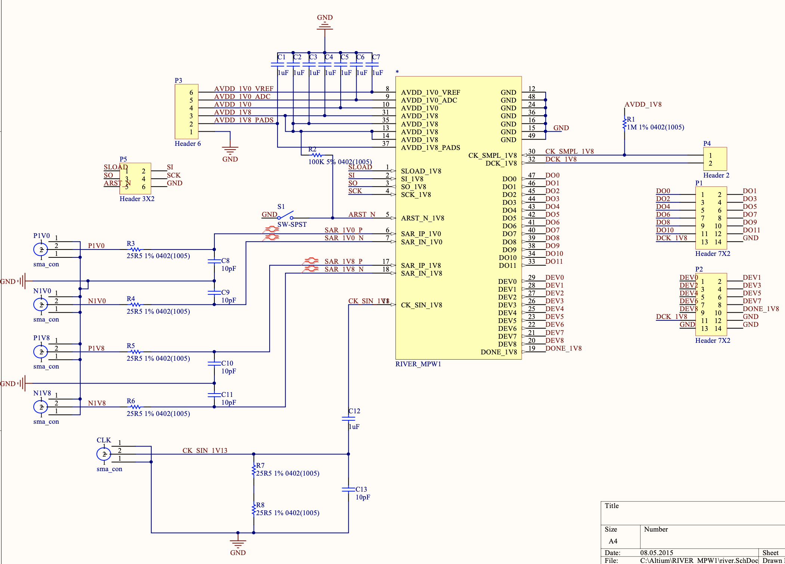
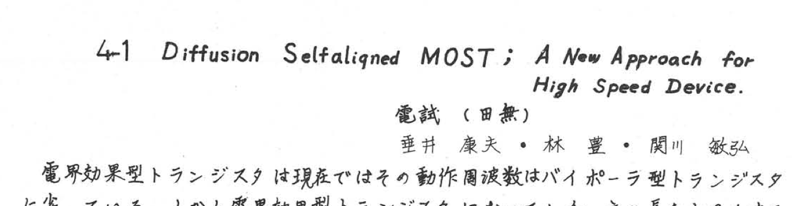
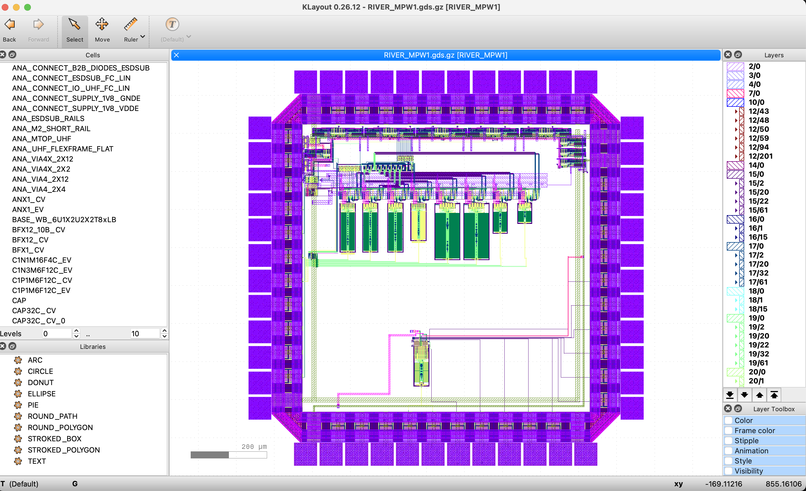
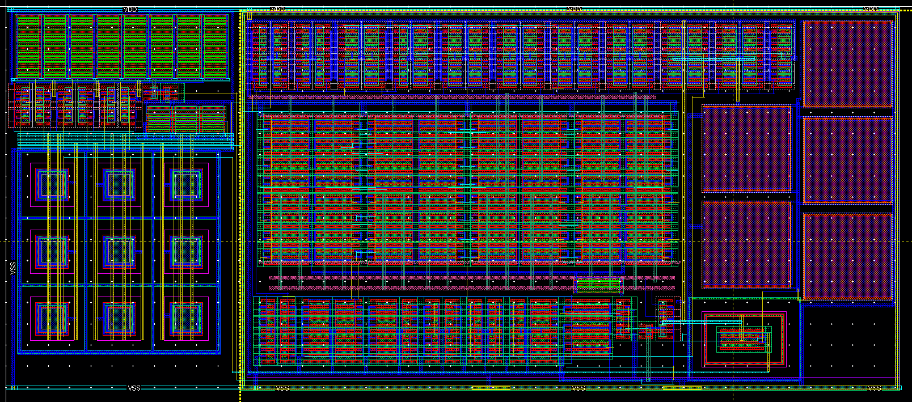
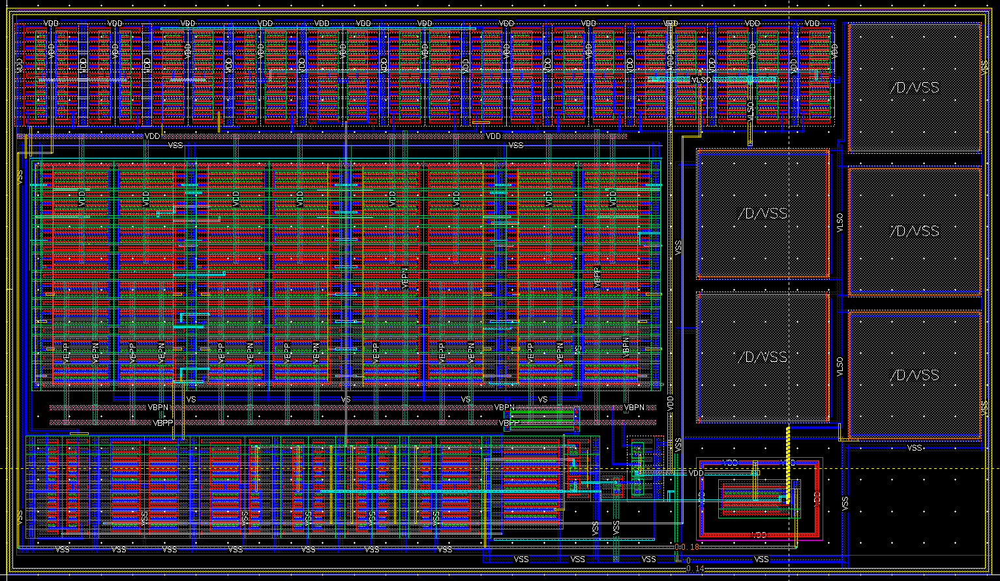
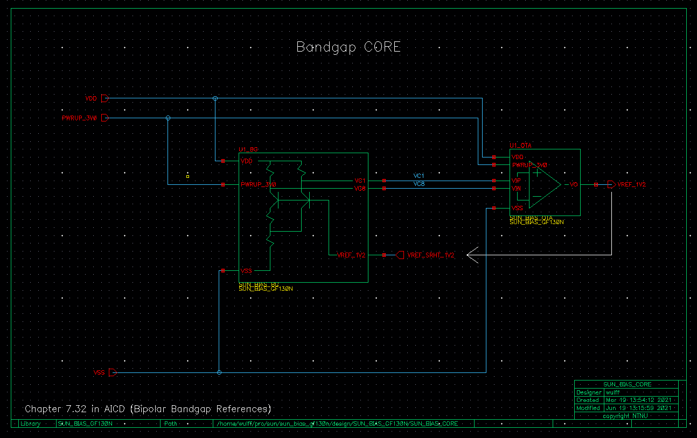
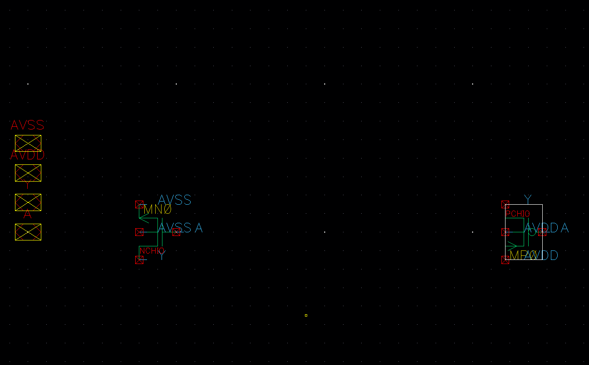
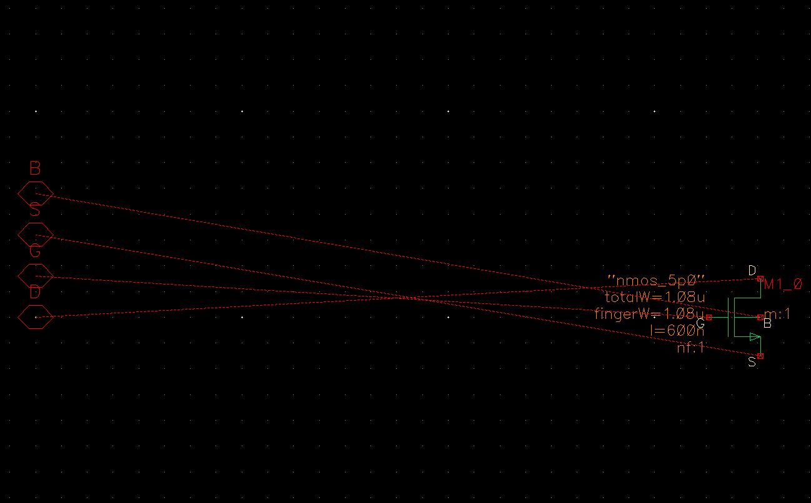
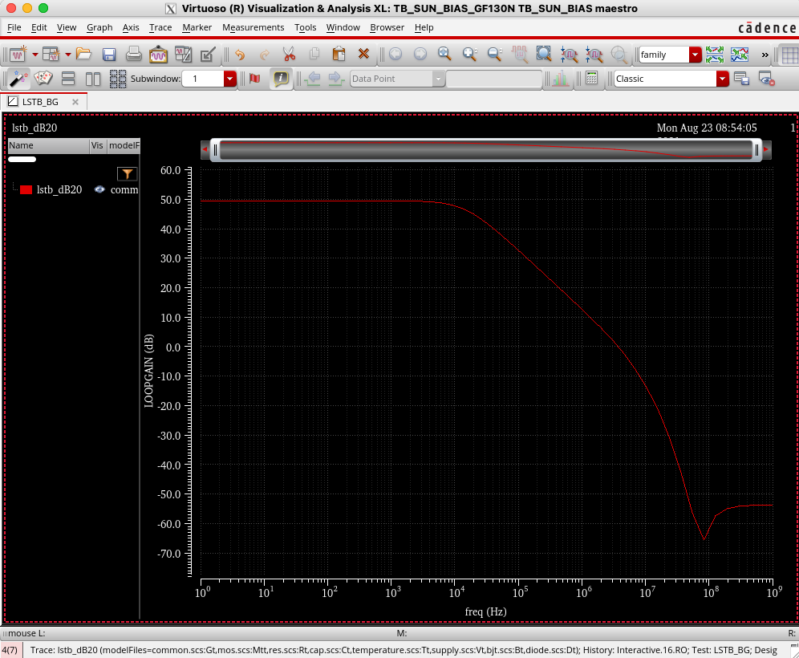
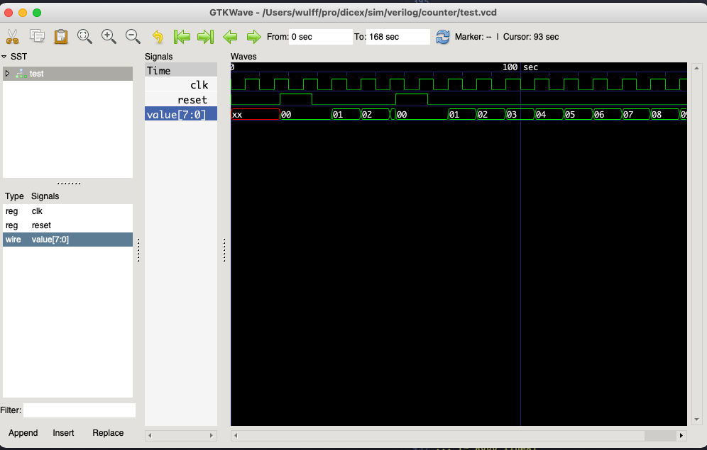

footer: Carsten Wulff 2021
slidenumbers:true
autoscale:true
theme: Plain Jane, 1
text:  Helvetica
header:  Helvetica

## TFE4152 - Lecture 2
# Manufacture Integrated Circuits

## [Source](https://github.com/wulffern/dic2021/blob/main/lectures/l2_manufacturing.md)

---

# Goal for today

* Why
* How

<!-- 
  - Wafer
  - Photolithography
  - Remove stuff
  - Add stuff
  - Cleaning
-->

* What

<!--
  - Digital flow 
  - Analog flow
-->

---

#[fit] Why

---


# Let's make a battery charger

---
# How

[.column]

- What does the use case require?
- What IC do we need?
- How is it connected to the real world?
- What pins do we need?
- What states are there?

[.column]


---

#[fit] How

---

# Printed Circuit Board (PCB)

---

[.column]




[.column]


---

- Many, many vendors 
- I know Ph.D that students have used [PCBway](https://www.pcbway.com/)
- Omega Verksted probably know best option
- Use [Altium](https://www.altium.com) to design the PCB 

---

# Package and Test

---


Many package options

Usually done by OSATS (Outsourced Semiconductor Assembly and Test)

[www.amkor.com](https://www.amkor.com)

[ase.aseglobal.com](https://ase.aseglobal.com)

---

 

<sub><sub>Online, https://www.iue.tuwien.ac.at/phd/poschalko/img410.png</sub></sub>

---

# Die

---

 

<sub><sub>Picture: nRF51822 (https://s.zeptobars.com/nRF51822.jpg)</sub></sub> 

---

# Who makes dies?

- TSMC, Globalfoundries, Samsung, UMC, SMIC ...
- Extremely high initial cost (k\$ to M\$)
- Low production cost (<< \$ per mm<sup>2</sup>)
- Sam Zeloof, made one i his garage [https://www.youtube.com/watch?v=IS5ycm7VfXg&t=3](https://www.youtube.com/watch?v=IS5ycm7VfXg&t=3)


---

# Wafer

---

### Ingot created with Czochralski Process


---
[.background-color: #000000]


# [Quantum Bound States](https://phet.colorado.edu/sims/cheerpj/bound-states/latest/bound-states.html?simulation=bound-states)

---

[.column]

> Everything should be made as simple as possible, but no simpler. (A. Einstein)


[.column]

[Crystal lattice](https://sketchfab.com/3d-models/silicon-crystal-lattice-73e292f32ffe4ca490e166faeba317e7)


---

# Photolithography

---

ArFr light source: 193 nm

Resolution: < 38 nm

Wafers per hour: > 250

Overlay: < 2.0 nm

Price: Don't know. Maybe 100 M$?

[https://www.youtube.com/watch?v=ShYWUlJ2FZs](https://www.youtube.com/watch?v=ShYWUlJ2FZs)


---

# EUV lithography

Light source : 13.5 nm
Resolution : ??
Wafers per hour : 100 ??
Price: ???


---
[.background-color: #000000]
[.text: #FFFFFF]


$$E = hf = hc/\lambda$$, where $$h = 4.1e-15 eV/Hz$$ and $$ c = 3e8$$

| Wavelength [nm] | Energy [eV] |
| :---:           | :---:       |
| 1000            | 1.2         |
| 240             | 5.1         |
| 193             | 6.4         |
| 90              | 13.6        |
| 13.5            | 91.1        |

Seems like the highest known band gap is about 13.5 eV (Lithium Fluoride) 

---


<sub><sub>Online, https://i1.wp.com/semiengineering.com/wp-content/uploads/2016/11/Screen-Shot-2016-11-15-at-4.04.00-PM.png?w=953&ssl=1</sub></sub>

---


---


# Add stuff

[Thermal oxidation](https://en.wikipedia.org/wiki/Thermal_oxidation)

[Chemical vapor deposition](https://en.wikipedia.org/wiki/Chemical_vapor_deposition)

[Atomic layer deposition](https://en.wikipedia.org/wiki/Atomic_layer_deposition)

[Ion implantation](https://en.wikipedia.org/wiki/Ion_implantation)

[Diffusion](https://ieeexplore.ieee.org/stamp/stamp.jsp?tp=&arnumber=1050758)

[Electroplating](https://en.wikipedia.org/wiki/Electroplating)

---

# Remove stuff

[Etching](https://en.wikipedia.org/wiki/Etching_\(microfabrication\))

[Chemical Mechanical Polish](https://en.wikipedia.org/wiki/Chemical-mechanical_polishing)

[RCA clean](https://en.wikipedia.org/wiki/RCA_clean)

---

# Diffusion

[.column]
[Diffusion Selfaligned MOST; A New Approach to High Speed Devices, 1969](https://confit.atlas.jp/guide/event-img/ssdm1969/4-1/public/pdf_archive?type=in)



[.column]
[Complementary DMOS Process for LSI](https://ieeexplore.ieee.org/stamp/stamp.jsp?tp=&arnumber=1050758)


---

 

---

#[fit] What

---

 

---

 

---


# How do we go from idea to GDSII?

---

#[fit] Layout

---

 

---

 

---

 

---


 

---

 

---

#[fit] Design

---

 

---

 

---


 

---

 


---

[.column]
```verilog
module counter(out, clk, reset);

  parameter WIDTH = 8;

  output [WIDTH-1 : 0] out;
  input 	       clk, reset;

  reg [WIDTH-1 : 0]   out;
  wire 	       clk, reset;

  always @(posedge clk or posedge reset)
    if (reset)
      out <= 0;
    else
      out <= out + 1;

endmodule // counter
```

https://github.com/wulffern/dicex/tree/main/sim/verilog/counter

[.column]
```verilog
/* Generated by Yosys 0.9 (git sha1 1979e0b) */

(* dynports =  1  *)
(* top =  1  *)
(* src = "counter.v:1" *)
module counter(out, clk, reset);
  (* src = "counter.v:11" *)
  wire [7:0] _00_;
...
  input reset;
  NOT _51_ (
    .A(_43_),
    .Y(_09_)
  );
...
  DFFSR _92_ (
    .C(clk),
    .D(_00_[7]),
    .Q(out[7]),
    .R(reset),
    .S(1'h0)
  );
  assign _43_ = out[0];
  assign _44_ = out[1];
  assign _45_ = out[2];
  assign _00_[2] = _11_;
  assign _46_ = out[3];
  assign _00_[3] = _12_;
  assign _47_ = out[4];
  assign _00_[4] = _13_;
  assign _48_ = out[5];
  assign _00_[5] = _14_;
  assign _49_ = out[6];
  assign _00_[6] = _15_;
  assign _50_ = out[7];
  assign _00_[7] = _16_;
  assign _00_[0] = _09_;
  assign _00_[1] = _10_;
endmodule
```

---

#[fit] Simulation


---


---


```

// Point Netlist Generated on: Aug 23 08:53:54 2021
// Generated for: spectre
// Design Netlist Generated on: Aug 23 08:53:53 2021
// Design library name: TB_SUN_BIAS_GF130N
// Design cell name: TB_SUN_BIAS
// Design view name: config
simulator lang=spectre
global 0
parameters t_pwrdwn=2 t_pwrup=1 pwrup=1 TFALL=100u TRISE=100u vdde=3.0
include "$PROJECT/lib/spectre/common.scs" section=Gt
include "$PROJECT/lib/spectre/mos.scs" section=Mtt
include "$PROJECT/lib/spectre/res.scs" section=Rt
include "$PROJECT/lib/spectre/cap.scs" section=Ct
include "$PROJECT/lib/spectre/temperature.scs" section=Tt
include "$PROJECT/lib/spectre/supply.scs" section=Vt
include "$PROJECT/lib/spectre/bjt.scs" section=Bt
include "$PROJECT/lib/spectre/diode.scs" section=Dt

// Inherited view list: spectre cmos_sch cmos.sch schematic veriloga ahdl
// pspice dspf
// Library name: SUN_BIAS_GF130N
// Cell name: SUN_BIAS
// View name: lpe_c_only_coupled
// View type: maskLayout
subckt SUN_BIAS IBPSR_1U\(25\) IBPSR_1U\(24\) IBPSR_1U\(23\) \
        IBPSR_1U\(22\) IBPSR_1U\(21\) IBPSR_1U\(20\) IBPSR_1U\(19\) \
        IBPSR_1U\(18\) IBPSR_1U\(17\) IBPSR_1U\(16\) IBPSR_1U\(15\) \
        IBPSR_1U\(14\) IBPSR_1U\(13\) IBPSR_1U\(12\) IBPSR_1U\(11\) \
        IBPSR_1U\(10\) IBPSR_1U\(9\) IBPSR_1U\(8\) IBPSR_1U\(7\) \
        IBPSR_1U\(6\) IBPSR_1U\(5\) IBPSR_1U\(4\) IBPSR_1U\(3\) \
        IBPSR_1U\(2\) IBPSR_1U\(1\) IBPSR_1U\(0\) PWRUP_3V0 VDD VFBI VFBO \
        VREF_1V2 VREF_BUFF_1V2 VREF_BUFF_1V2_FB VREF_FB VSS
        U1_VI\|R2 (U1_VI\|VS1 U1_VI\|53 VSS) ppolyf_u l=1e-05 w=5e-07 par=1 \
        s=1 m=1 dtemp=0
... (~ 8000 lines)

VVDD (VDD VSS) vsource dc=vdde type=pulse val0=0 val1=vdde period=5 \
        rise=TRISE fall=TFALL
V1 (PWRUP_3V0 VSS) vsource dc=pwrup*vdde type=pwl wave=[ 0 0 (t_pwrup) 0 \
        (t_pwrup + 1n) vdde (t_pwrdwn) vdde (t_pwrdwn + 1n) 0 ]
...
```

 

---

```verilog
module counter(out, clk, reset);

  parameter WIDTH = 8;

  output [WIDTH-1 : 0] out;
  input 	       clk, reset;

  reg [WIDTH-1 : 0]   out;
  wire 	       clk, reset;

  always @(posedge clk or posedge reset)
    if (reset)
      out <= 0;
    else
      out <= out + 1;

endmodule // counter
```

 

---
# Want to learn more?

Preview of Advanced Integrated Circuits

[AIC - Layout](https://youtube.com/playlist?list=PLybHXZ9FyEhYDBSJaHqvx0rVH6mHBgl_2)
[AIC - Schematic](https://youtube.com/playlist?list=PLybHXZ9FyEhaVbo8Su9XgAOkCsJYSP5mv)
[AIC - General](https://youtube.com/playlist?list=PLybHXZ9FyEhYUZvAkZ2oeMkkP7YkEYDPo)
[AIC - cheatsheet](https://github.com/wulffern/ciccheatgen/blob/main/pdf/aic.pdf)

---

#[fit] Thanks!


