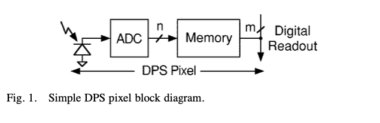
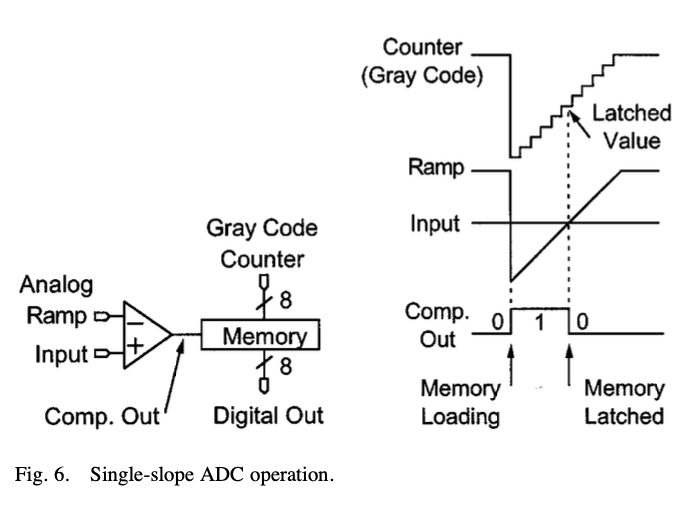
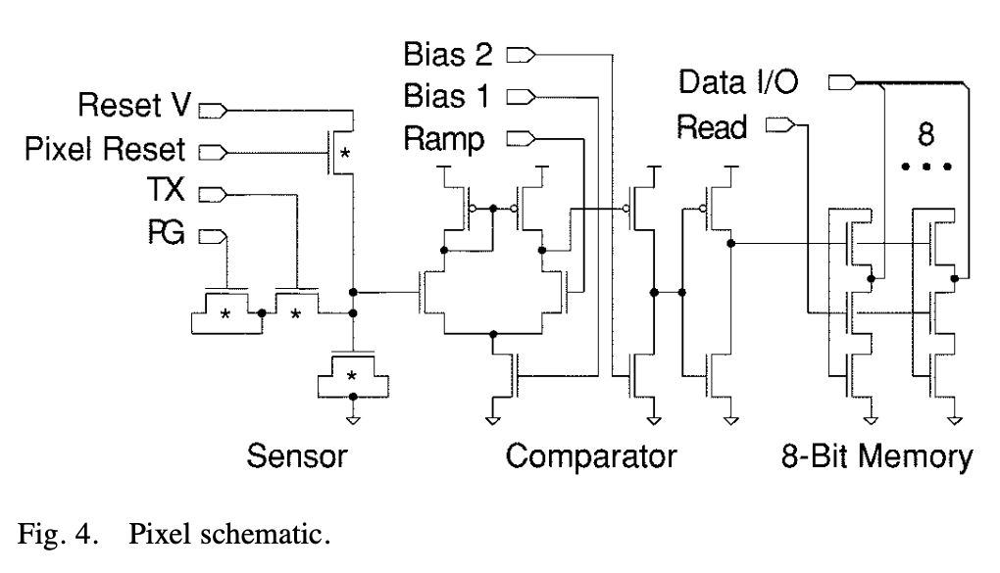
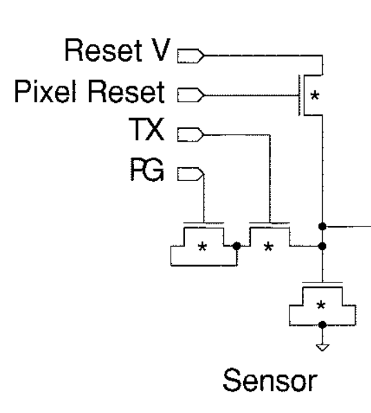
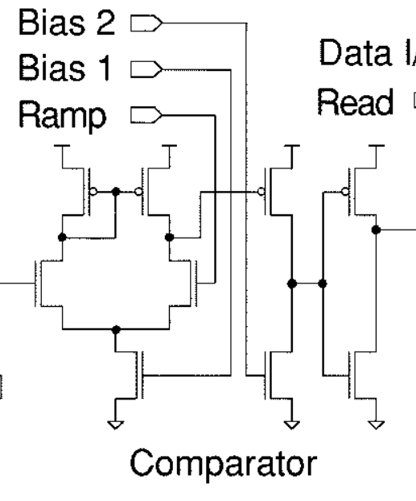
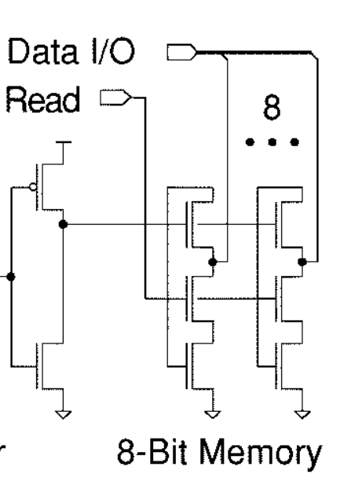
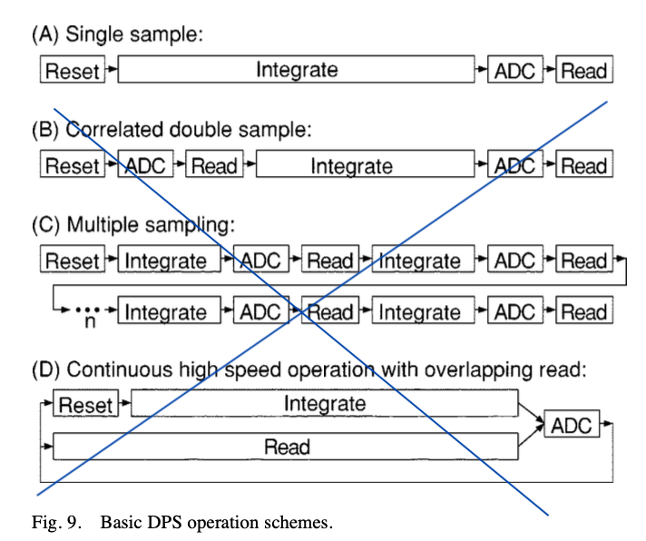
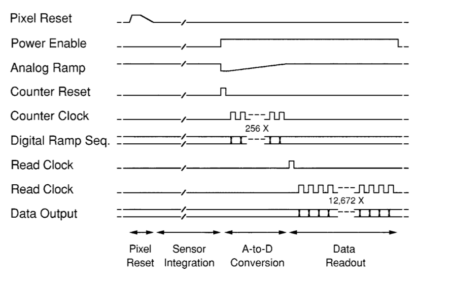

footer: Carsten Wulff 2021
slidenumbers:true
autoscale:true
theme: Plain Jane, 1
text:  Helvetica
header:  Helvetica

## TFE4152 - Lecture 6
# Project

## [Source](https://github.com/wulffern/dic2021/blob/main/lectures/l6_project.md)

---

# Goal for today

Make it easier to understand the project

---

#[fit] Project

---

- 30 % of final grade
- Groups of 2 people. Find a partner soon. Sign up on blackboard.
- Deadline: 19'th November before 12:00 (24 hour format). 
- Strict deadline, $$t > 12:00 \equiv fail$$. Both members in group must submit report.

---

# Goal
Be inspired by the ISSCC paper, and design a similar system. 

Design analog circuits in SPICE 

Design digital circuits in SystemVerilog

---

# [A 10 000 Frames/s CMOS Digital Pixel Sensor](https://ieeexplore.ieee.org/stamp/stamp.jsp?tp=&arnumber=972156)


---



photon sensor $$\Rightarrow$$ local analog to digital converter $$\Rightarrow$$ local memory

---




---


---


---



---



# SENSOR

---


---

# COMP




---



# MEMORY


---



---



---

# Minimum implementation 
- Model of 2 x 2 pixel array in SystemVerilog
- State machine to control reset, exposure, analog-to-digital conversion, and readout of the pixel array
- SPICE of pixel sensor (sensor, comparator)
- Report documenting that the circuits (analog and digital) work as designed

---

# Things it's OK to ignore

- Transistor corners
- Gray counter (but if you do, then it will be hard to get the ADC accurate)
- Voltage variation
- Temperature variation
- "nice to have features", like power optimalization, testability

---

# [Gray codes](https://en.wikipedia.org/wiki/Gray_code)

[.column]

|Decimal| Binary | Gray |
| :---: | :---: | :---: |
|0 | 000 | 000|
|1 | 001 | 001|
|2 | 010 | 011|
|3 | 011 | 010|
|4 | 100 | 110|
|5 | 101 | 111|
|6 | 110 | 101|
|7 | 111 | 100|

[.column]

dicex/sim/verilog/graycounter.v

```verilog
module graycounter(out, clk, reset);

   parameter WIDTH = 8;

   output [WIDTH-1 : 0] out;
   input                clk, reset;

   logic [WIDTH-1 : 0]  out;
   wire                 clk, reset;

   logic [WIDTH-1 : 0]  q;


   always @(posedge clk or posedge reset) begin
      if (reset)
        q <= 0;
      else begin
         q <= q + 1;
      end
      out <= {q[WIDTH-1], q[WIDTH-1:1] ^ q[WIDTH-2:0]};
   end

endmodule // graycounter

```

---


---


---

[.column]
# Analog Simulators
aimspice, ngspice, spectre, eldo, hspice

Time evolution (transient analysis) is a numerical analysis to differential equations for voltage and current. For example [Newton's method](https://en.wikipedia.org/wiki/Newton%27s_method)

1. Take a small time step, iterate numerical analysis until error is low enough, if error is too large, chose shorter time step
2. Go to 1


For more info, see [In a Nutshell: How SPICE Works](https://www.emcs.org/acstrial/newsletters/summer09/HowSpiceWorks.pdf)

Can simulate digital circuits, but very slowly


[.column]
# Digital Simulators 
iverilog, questa, xcelium, vcs

Time evolution with time steps, and delta-time

1. Next time step (i.e clock cycle)
2. What signals change at this time step?
3. Compute new signal values, and schedule changes in future
4. Should any of the signals that changed now affect other signals now? If yes, then take delta time step
5. If delta timestep, then go to 2. If no more delta timestep, go to 1.

**Cannot simulate analog differential equations!**

---

# Mixed-Signal Simulators

Control time in both analog and digital simulator

Provide analog-to-digital and digital-to-analog converters to "mirror" signals in the other simulator

Not sure there is an open source mixed-signal simulator


---

# What you get

[github.com/wulffern/dicex](https://github.com/wulffern/dicex)

```
project/
├── spice/
│   ├── Makefile                # See https://www.gnu.org/software/make/manual/html_node/Introduction.html
│   ├── pixelSensor.cir         # Almost empty circuit for pixelSensor
│   └── pixelSensor_tb.cir      # SPICE testbench for pixelSensor, emulates verilog
└── verilog/
    ├── Makefile                
    ├── pixelSensor.fl          # Verilog file list
    ├── pixelSensor_tb.gtkw     # Save file for GTKWave
    ├── pixelSensor_tb.v        # Verilog testbench for pixelSensor
    └── pixelSensor.v           # Verilog model of analog pixelSensor circuit
```

---

#[fit] What you should do

---

# Model of 2 x 2 pixel array in SystemVerilog

Make a SystemVerilg module (i.e `pixelArray.v`), that use `pixelSensor.v`

Figure out which signals need to be a bus, and what signals are common for the pixels

Make a testbench `pixelArray_tb.v` to check that the `pixelArray.v` compiles and do some rudementary tests to check that you've hooked things up correctly

---
# State machine 

Make a SystemVerilog module `pixelState.v` that can connect to `pixelArray.v`

Make a state machine to control reset, exposure, analog-to-digital conversion, and readout of the pixel array

Make a testbench `pixelState_tb.v` to test the state machine

---

# Top verilog

Make a SystemVerilog module `pixelTop.v` that connects `pixelState.v` to `pixelArray.v`

Make a testbench `pixelTop_tb.v` to test the statemachine and readout of the 2 x 2 array

---
# SPICE of pixel sensor

Copy `pixelSensor.cir` to another name

Copy `pixelSensor_tb.cir` to another name

Make the design from the paper (Fig. 4)
- Sensor (SENSOR)
- Comparator (COMP)
- Memory (MEMORY)

Add something (like `Rphoto` in `pixelSensor.tb`) to model the photocurrent.

Add a testbench for each subcircuit (COMP, SENSOR, MEMCELL, MEMORY)

---

# Report 1/2

- **Introduction** = Why?
- **Theory** = How?
  - As little information as possible. Give references to sources. Assume that
  the reader has read the paper. 
- **Implementation** = What?
  - Describe what you designed
  - State diagrams, with explanation
  - Circuit diagrams, with explanation
  - One sub-chapter per block
  
---

# Report 2/2
- **Verification** = Are you sure it works?  
  - Describe your testbenches, and how you verified your design
  - Describe key results
  - Describe known problems (incase something does not work)
- **Discussion and conclusion** = Why do you deserve a good grade? 
- **Appendix**
  - SPICE netlist
  - SystemVerilog netlists
  - SystemVerilog testbenches
  
---

# Proposed plan

| Week | Plan                            |
|:------:|:---------------------------------|
| 34   | Register group                  |
| 35   | Read and understand paper       |
| 36   | Sketch what you want to do      |
| 37   | Write theory chapter  in report |
| 38   | Design & simulation             |
| 39   | Design & simulation             |
| 40   | Design & simulation             |
| 41   | Design & simulation             |
| 42   | Verification                    |
| 43   | Verification                    |
| 44   | Write report                    |
| 45   | Write report                    |
| 46   | **Deadline**                    |


---

# What you get

[github.com/wulffern/dicex](https://github.com/wulffern/dicex)

```
project/
├── spice/
│   ├── Makefile                # See https://www.gnu.org/software/make/manual/html_node/Introduction.html
│   ├── pixelSensor.cir         # Almost empty circuit for pixelSensor
│   └── pixelSensor_tb.cir      # SPICE testbench for pixelSensor, emulates verilog
└── verilog/
    ├── Makefile                
    ├── pixelSensor.fl          # Verilog file list
    ├── pixelSensor_tb.gtkw     # Save file for GTKWave
    ├── pixelSensor_tb.v        # Verilog testbench for pixelSensor
    └── pixelSensor.v           # Verilog model of analog pixelSensor circuit
```

Let's check what's inside the files

---

#[fit] Thanks!

---


