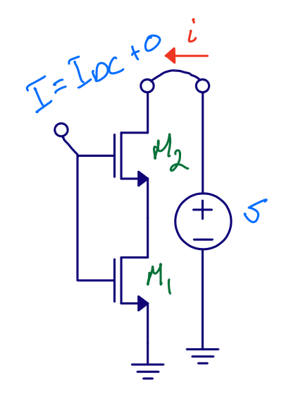
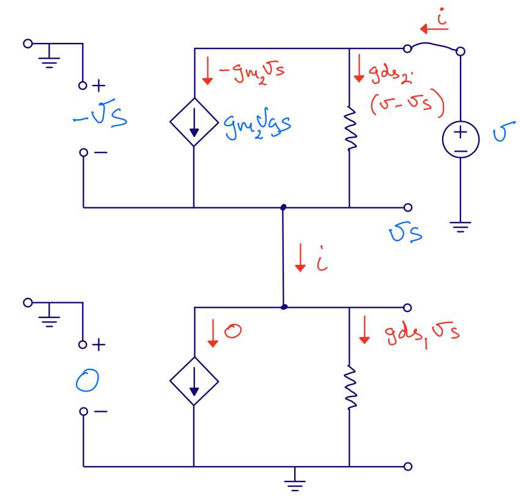
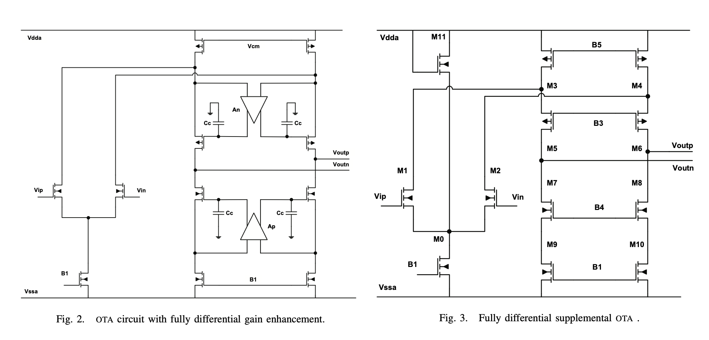
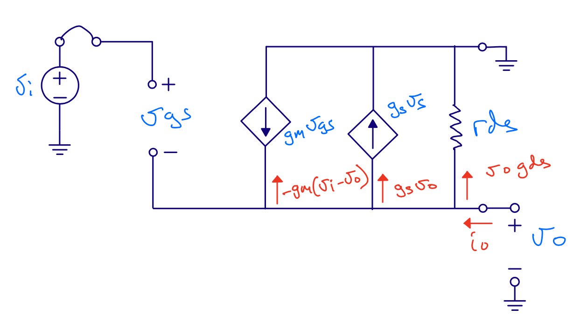
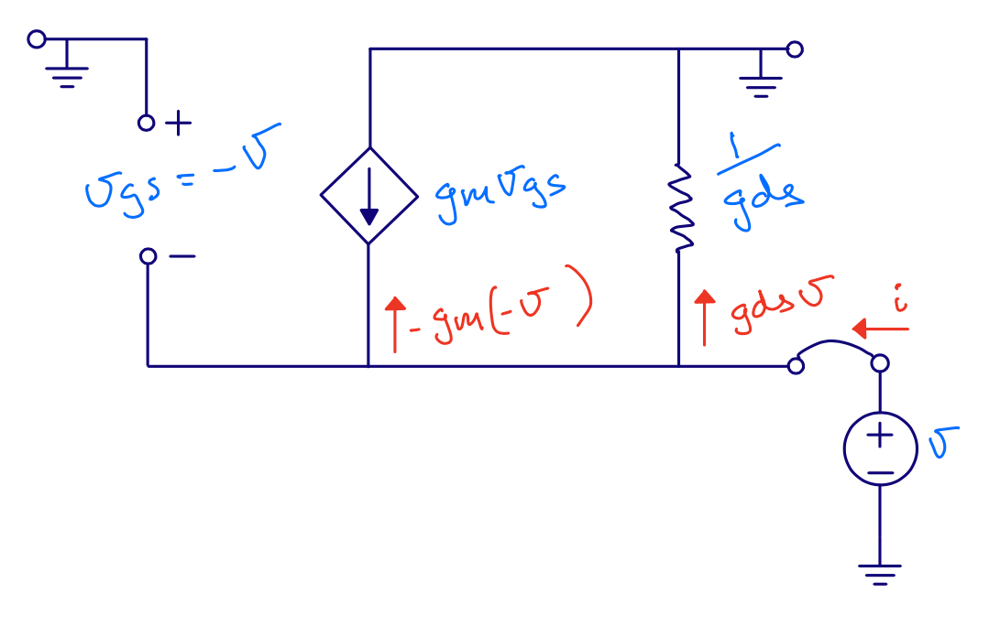
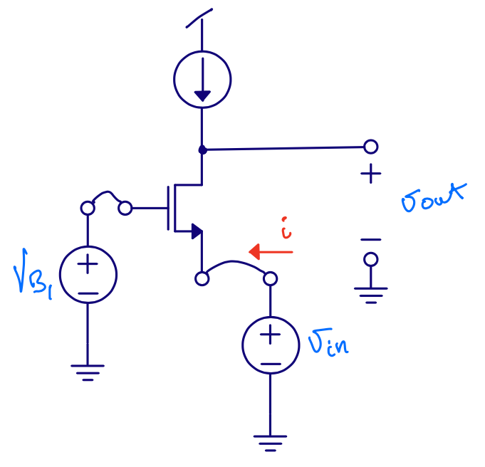
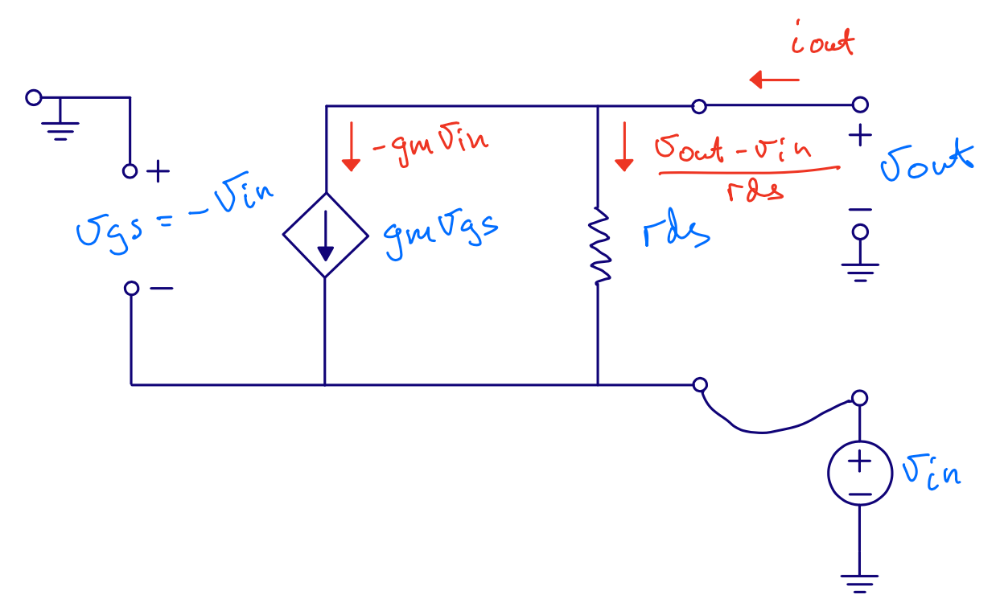
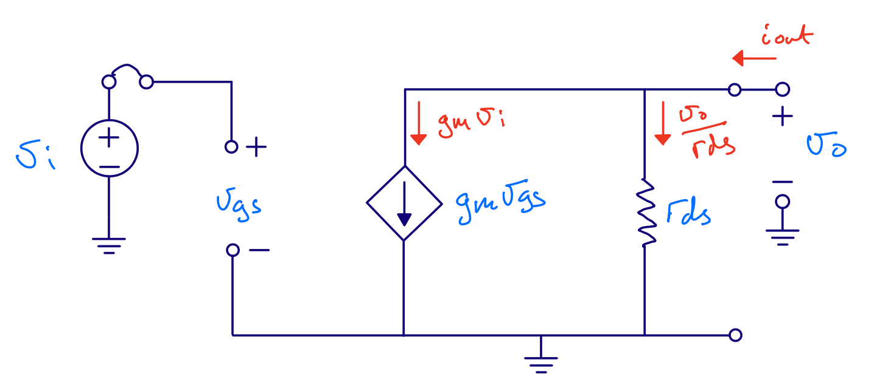
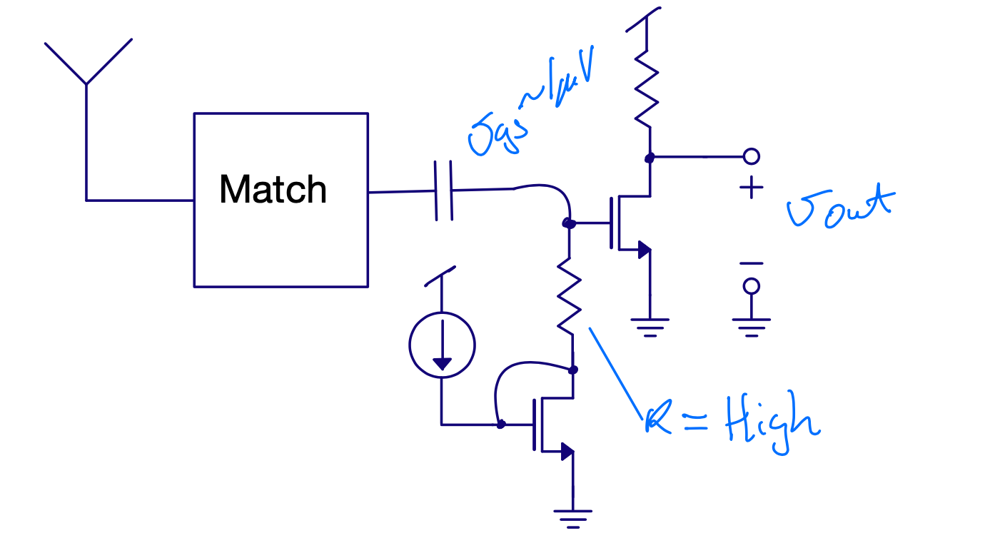
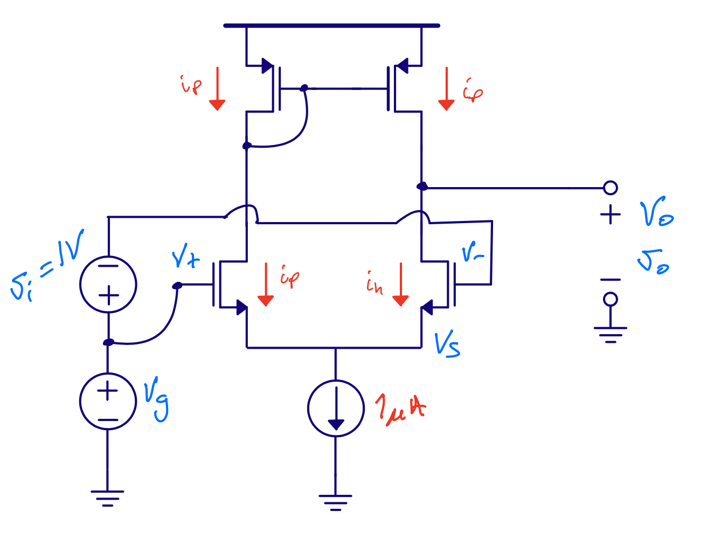

footer: Carsten Wulff 2021
slidenumbers:true
autoscale:true
theme: Plain Jane, 1
text:  Helvetica
header:  Helvetica

## TFE4152 - Lecture 9
# Current mirrors and Amplifiers

## [Source](https://github.com/wulffern/dic2021/blob/main/lectures/l9_cm.md)

---

| Week | Book                    | Monday                                                                    | Book                    | Friday                               |
|------|-------------------------|---------------------------------------------------------------------------|-------------------------|--------------------------------------|
| 34   |                         | Introduction, what are we going to do in this course. Why do you need it? | WH 1 , WH 15            | Manufacturing of integrated circuits |
| 35   | CJM 1.1                 | pn Junctions                                                              | CJM 1.2 WH 1.3, 2.1-2.4 | Mosfet transistors                   |
| 36   | CJM 1.2 WH 1.3, 2.1-2.4 | Mosfet transistors                                                        | CJM 1.3 - 1.6           | Modeling and passive devices         |
| 37   |                         | Guest Lecture - Sony                                                      | CJM 3.1, 3.5, 3.6       | Current mirrors                      |
| 38   | CJM 3.2, 3.3,3.4 3.7    | **Amplifiers**                                                                | CJM, CJM 2 WH 1.5   | SPICE simulation  and layout         |
| 39   |                         | Verilog                                                                   |                         | Verilog                              |
| 40   | WH 1.4 WH 2.5           | CMOS Logic                                                                | WH 3                    | Speed                                |
| 41   | WH 4                    | Power                                                                     | WH 5                    | Wires                                |
| 42   | WH 6                    | Scaling Reliability and Variability                                       | WH 8                    | Gates                                |
| 43   | WH 9                    | Sequencing                                                                | WH 10                   | Datapaths - Adders                   |
| 44   | WH 10                   | Datapaths - Multipliers, Counters                                         | WH 11                   | Memories                             |
| 45   | WH 12                   | Packaging                                                                 | WH 14                   | Test                                 |
| 46   |                         | Guest lecture - Nordic Semiconductor                                      |                         |                                      |
| 47   | CJM                     | Recap of CJM                                                              | WH                      | Recap of WH                          |

---
# Goal for today

Current mirrors

Amplifiers

---

#[fit] Errata

---

# Process variations - Correction 

**Wrong**
Assume strong inversion and active **$$ V_{eff} = \sqrt{2\mu_p C_{ox} \frac{W}{L} I_1} $$**

**Correct**
Assume strong inversion and active **$$ V_{eff} = \sqrt{\frac{2}{\mu_p C_{ox} \frac{W}{L}} I_1} $$**
 
---

#[fit] Large signal vs  small signal 

---

---

# $$ I \ne i $$

# $$ V \ne v $$

---

# $$ I  =  I_{bias} +  i $$

# $$ V = V_{bias} +  v $$

---

# Current Mirror

$$M_1$$ is diode connected ($$V_G = V_D$$)

---

# Current mirror $$r_{in}$$

 $$ r_{ds} = \frac{1}{g_{ds}} $$

 $$ r_{in} = \frac{v}{i} $$

 $$ i = g_m v + g_{ds} v$$

 $$ r_{in} = \frac{1}{gm + gds} \approx \frac{1}{gm} $$

---
# Current mirror $$r_{out}$$

Output voltage does not affect $$v_{gs}$$

 $$r_{out} = r_{ds}$$

---

# Source degeneration

What is the operating region of M3 and M4?

What is the operating region of M1 and M2?

---

---

---

---

# Source degeneration $$ r_{out}$$

$$v_{gs1}  = 0 $$

$$v_{gs2} = -v_s$$

$$ i = g_{ds1} v_s \Rightarrow v_s = i r_{ds1} $$

$$r_{out} = \frac{v}{i}$$

$$i = -g_{m2} v_{s} + \frac{v - v_s}{r_{ds2}}$$

---

$$i = -g_{m2} v_{s} + \frac{v - v_s}{r_{ds2}}$$ insert $$ v_s = i r_{ds1}$$

$$i = -i g_{m2} r_{ds1} + \frac{v - i r_{ds1}}{r_{ds2}}$$

$$ i r_{ds2} + i g_{m2}r_{ds1}r_{ds2} + i r_{ds1} = v$$

$$  r_{ds2} + g_{m2}r_{ds1}r_{ds2} + r_{ds1} = \frac{v}{i} $$ 

$$ r_{out} = r_{ds2} \left[1 + r_{ds1} \left( \frac{1}{r_{ds2}}  + g_{m2}\right )\right] $$

$$ r_{out} =  r_{ds2}\left[1 + r_{ds1}(g_{m2} + g_{ds2})\right] $$

---

 

[.column]

[.column]

$$ r_{out} =  r_{ds2}[1 + r_{ds1}(g_{m2} + g_{ds1})] $$

---

# Cascode current mirror

Same equation as  source degeneration, but $$M_2$$ is in saturation

$$r_{ds2(\text{saturation})} > r_{ds2(\text{linear})} $$

$$r_{out} =  r_{ds4}[1 + r_{ds2}(g_{m4} + g_{ds2})] $$

---

---

# One more current mirror ...

---

["High speed, high gain OTA in a digital 90nm CMOS technology" Berntsen, Wulff, Ytterdal](https://ieeexplore.ieee.org/document/1597006)

<!-- http://www.wulff.no/publications/berntsen.pdf  -->
---

#[fit] Amplifiers

---

#[fit] Source follower

---
# Source follower

Input resistance $$\approx \infty$$

Gain $$ A = \frac{v_o}{v_i}$$?

Output resistance $$r_{out}$$?

---

---

# Source follower - Gain

$$ i_o = v_o (g_{ds} + g_{s}) - g_{m} v_i + v_o g_m $$

$$ i_o = 0 $$

$$ g_m v_i = v_o ( g_m + g_s + g_{ds} ) $$

$$ A = \frac{v_o}{v_i} = \frac{g_m}{g_m + g_{ds} + g_s} $$

## Gain is less than 1
    

---

# Source follower - $$r_{out}$$

$$ i_o = v_o (g_{ds} + g_{s}) - g_{m} v_i + v_o g_m $$

$$v_i = 0$$

$$ i_o = v_o (g_{ds} + g_{s} + g_m) $$

$$ r_{out} = \frac{v_o}{i_o} = \frac{1}{g_m + g_{ds} + g_{s}} $$

$$ r_{out} \approx \frac{1}{g_m}$$

---

---

Assume 100 electrons

[.column]

$$ \Delta V  = Q/C  = -1.6 \times 10^{-19} \times 100 / (1\times 10^{-15}) = - 16\text{ mV} $$ 

[.column]

$$ \Delta V  = Q/C  = -1.6 \times 10^{-19} \times 100 / (1\times 10^{-12}) = - 16\text{ uV} $$ 

---

#[fit] Common gate

---

# Common gate 

Input resistance ?

Gain ? 

Output resistance ? 

---

---

# Common gate - $$r_{in}$$

$$ i = g_m v + g_{ds} v $$

$$ r_{in} = \frac{1}{g_m + g_{ds}} \approx \frac{1}{g_m}$$

However, we've ignored load resistance. 

$$ r_{in}  \approx \frac{1}{g_m}\left(1 + \frac{R_L}{r_{ds}}\right) $$

---

# Common gate - $$r_{out}$$

---

---

# Common gate - $$r_{out}$$

$$r_{out} = r_{ds}$$

---

# Common gate - Gain

---

---

# Common gate - Gain

$$ i_{o} = - g_m v_{i} + \frac{v_{o} - v_{i}}{r_{ds}} $$

$$ i_{o}  = 0 $$

$$ 0 = - g_m v_{i} r_{ds}  + v_{o} - v_{i}$$

$$ v_{i} (1 + g_m r_{ds}) = v_{o} $$

$$ \frac{v_o}{v_i} = 1 + g_m r_{ds} $$

---

# Common gate - Gain

We've ignored bulk effect ($$g_s$$), source resistance ($$R_S$$) and load resistance ($$R_L$$)

$$ A = \frac{(g_{m} + g_s + g_{ds})(R_L||r_{ds})}{1 + R_S\left(\frac{g_m + g_s +
g_{ds}}{1 + R_L/r_{ds}}\right)}$$

If $$R_L >> r_{ds} $$, $$R_S  = 0$$ and $$g_s = 0$$

$$ A = \frac{(g_{m} + g_{ds})r_{ds}}{1} = 1+ g_m r_{ds} $$ 

---

#[fit] Common source

---

# Common source

Input resistance $$r_{in} \approx \infty$$

Output resistance $$r_{out}  = r_{ds}$$, it's same circuit as the output of a current mirror

Gain ? 

---

---
# Common source - Gain

$$ i_{o} = g_m v_i + \frac{v_o}{r_{ds}} $$

$$ i_o = 0 $$

$$ -g_m v_i = \frac{v_o}{r_{ds}} $$

$$ \frac{v_o}{v_i} = - g_m r_{ds}$$

---

---
# Differential pair

Input resistance $$r_{in} \approx \infty$$

Gain  $$ A  = g_m r_{ds} $$

Output resistance $$ r_{out} = r_{ds}$$

Best analyzed with T model of transistor (see CJM page 31)

---

# Diff pairs are cool

 Can choose between 

 $$ v_o = g_m r_{ds} v_i$$

 and 

 $$ v_o = -g_m r_{ds} v_i$$
 
 by flipping input (or output) connections

---

---

#[fit] Thanks!

---

